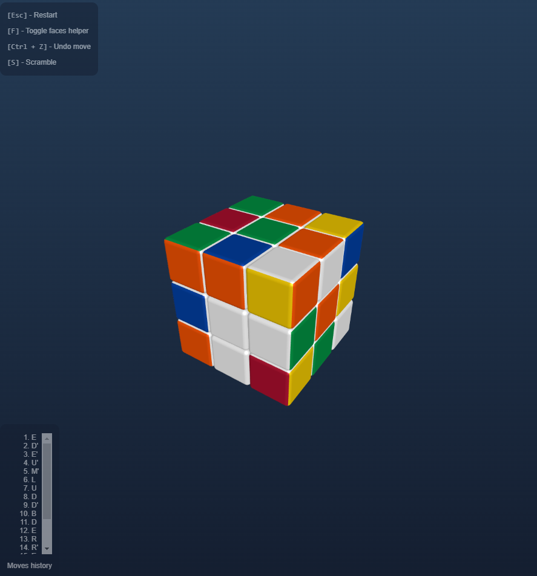

# Rubik's Cube Game


This repository contains a 3D Rubik's Cube game built using Three.js. It provides an interactive experience where users can manipulate the cube and solve it just like a physical Rubik's Cube.

## Features

- **Undo**: Revert the last move to correct mistakes.
- **Reset**: Reset the cube to its solved state.
- **Scramble**: Randomly shuffle the cube for a new challenge.
- **Drag to Rotate**: Click and drag the cube to rotate its faces interactively.

## Getting Started

1. Clone the repository:

```bash
git clone https://github.com/ridolud/rd-playground-rubik.git
```

2. Navigate to the project directory:

```bash
cd rd-playground-rubik
```

3. Install dependencies using pnpm:

```bash
pnpm install
```

4. Start the development server with Vite:

```bash
pnpm run dev
```

5. Open your browser and navigate to the provided local development URL to view the project.

## Technologies Used

- [Three.js](https://threejs.org/) for 3D rendering.
- JavaScript for game logic.

## How to Play

1. Use your mouse to drag and rotate the cube.
2. Click on a face to rotate it.
3. Use the provided buttons to undo, reset, or scramble the cube.
4. Keyboard shortcuts:
   - <code>[Esc]</code>: Restart the game.
   - <code>[F]</code>: Toggle faces helper.
   - <code>[Ctrl + Z]</code>: Undo the last move.
   - <code>[S]</code>: Scramble the cube.

Enjoy solving the Rubik's Cube!
